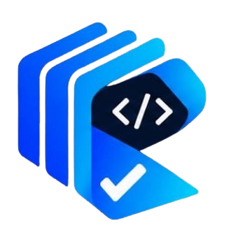
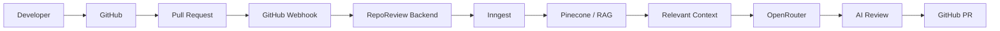

<div align="center">



# RepoReview

### AI code review that understands your entire codebase.

RepoReview is an AI-powered GitHub code review platform that uses Retrieval-Augmented Generation (RAG) to understand repository-wide context before reviewing Pull Requests.


[🌐 Live Demo](https://reporeview.peeyushtiwari.online/) • [📦 GitHub Repository](https://github.com/peeyushtiwari888/ai-code-review-project)

</div>

---

## 📸 Product Preview


---

## 🌐 Live Demo

**Live:** [https://reporeview.peeyushtiwari.online/](https://reporeview.peeyushtiwari.online/)

Explore the production deployment to experience the landing page, authentication flow, dashboard and product experience.

---

## What is RepoReview?

Traditional AI/code review tools often focus primarily on the Pull Request diff. 

RepoReview takes a broader approach by retrieving relevant repository context before generating the review. This creates a true AI Code Review assistant.

**PR changes + Repository context ↓ AI analysis ↓ Context-aware review**

---

## Why RepoReview?

**Traditional Review:**
- Mostly focused on changed lines
- Limited repository context
- Harder to understand cross-file dependencies

**RepoReview:**
- Repository-aware analysis
- RAG-powered context retrieval
- GitHub-native workflow
- Automated Pull Request reviews
- Background processing for long-running tasks
- Actionable AI findings

---

## ✨ Features

### 🧠 Repository-Aware AI
AI reviews Pull Requests using relevant repository context.

### 🔎 RAG-Powered Context
Pinecone retrieves semantically relevant code from the repository.

### 🔗 GitHub Integration
Connect GitHub repositories and work with Pull Requests through the GitHub integration.

### ⚡ Automated Reviews
Pull Request events can trigger the review workflow.

### 🏗️ Background Processing
Inngest handles long-running repository synchronization and AI review workflows.

### 🤖 AI-Powered Analysis
OpenRouter provides access to AI models used for generating code reviews.

### 🔐 Authentication
Better Auth + GitHub OAuth handles secure authentication.

### 💳 Subscription System
Razorpay is used for the project's billing/subscription functionality.

---

## ⚙️ How RepoReview Works

```text
Developer
   ↓
GitHub
   ↓
Pull Request
   ↓
Webhook
   ↓
RepoReview Backend
   ↓
Inngest
   ↓
RAG / Pinecone
   ↓
Relevant Repository Context
   ↓
OpenRouter
   ↓
AI Review
   ↓
GitHub Pull Request
```

1. **Webhook Trigger:** When a developer opens or updates a Pull Request, GitHub sends a webhook to the RepoReview backend.
2. **Background Processing:** The task is handed off to Inngest for reliable background processing.
3. **Context Retrieval:** Pinecone is queried to retrieve the most semantically relevant code chunks from the entire repository (RAG).
4. **AI Generation:** OpenRouter supplies the LLM with the PR diff and the retrieved context to generate a comprehensive review.
5. **Feedback Delivery:** The generated review is posted directly back to the GitHub Pull Request.

---

## 🧠 How RAG Improves Code Reviews

Traditional:
**Pull Request Diff → AI → Review**

RepoReview:
**Pull Request Diff + Relevant Repository Context → AI → Context-Aware Review**

Repository code is processed into chunks and embeddings, stored in Pinecone, and relevant context is retrieved during review processing. This allows the AI to understand how a small change in one file affects other interconnected components across the codebase.

---

## 🏗️ Architecture



---

## 📁 Project Structure

```text
ai-code-review/
├── app/               # Next.js App Router pages and API routes
├── components/        # Reusable UI components (shadcn/ui)
├── features/          # Domain-specific logic (auth, dashboard, repo-sync, github)
├── hooks/             # Custom React hooks
├── lib/               # Shared utilities and configuration
├── prisma/            # Database schema and migrations
├── public/            # Static assets and branding
├── scripts/           # Utility scripts
└── README.md          # Project documentation
```

---

## 🔄 Review Workflow

1. Repository is connected.
2. Repository content is synchronized.
3. Code is processed for contextual retrieval.
4. Pull Request event is received.
5. Background review workflow starts.
6. Relevant context is retrieved.
7. PR changes + context are sent for AI analysis.
8. Review is generated.
9. Review is integrated into the GitHub PR workflow.

---

## 🚀 Getting Started

Clone and install the project using npm:

```bash
git clone https://github.com/peeyushtiwari888/ai-code-review-project.git
cd ai-code-review-project
npm install
```


## 💻 Run Locally

Start the local development server:

```bash
npm run dev
```

---

## 🗄️ Database

Prisma manages database access. Ensure your database is running before executing these commands:

```bash
npx prisma generate
npx prisma db push
```

---

## 🎨 Design

- Premium developer-focused UI
- Blue + cyan visual identity
- Dark and light mode
- Responsive design
- Subtle interactions
- Technical product visualization
- Accessible UI
- shadcn/ui + Tailwind CSS

The interface is designed to feel like serious developer infrastructure rather than a generic AI startup.

---

## 📱 Responsive Design

Full support across all major device categories:
- Desktop
- Tablet
- Mobile

Major product surfaces automatically adapt to smaller screens ensuring seamless usability on the go.

---

## 🔐 Security Considerations

- Better Auth for secure session management
- GitHub OAuth for authorized platform access
- GitHub App integration for repository scoping
- Webhook validation to secure incoming events
- Server-side processing for sensitive workflows
- Protected authenticated routes

---

## 🛣️ Future Improvements

- More detailed review analytics
- Custom review rules
- Team-level repositories
- Review history
- More AI model options
- Advanced repository filtering
- Review severity configuration

---

## 🧑‍💻 Engineering Highlights

This Developer Tools SaaS product demonstrates experience with:
- Full-stack Next.js architecture
- TypeScript
- GitHub APIs
- OAuth
- Webhooks
- Background jobs
- Vector databases
- RAG (Retrieval-Augmented Generation)
- AI integration
- Database design
- SaaS architecture
- Responsive UI
- Authentication
- Subscription/billing workflows

---

## 🎯 Project Goal

RepoReview aims to make AI-assisted code review more context-aware by combining Pull Request changes with relevant repository knowledge.

---

## 👨‍💻 Author

Built by [Peeyush Tiwari](https://github.com/peeyushtiwari888)

---

## 🚀 Try RepoReview

Give your Pull Requests a reviewer that understands the codebase around them.

**Live Demo:** [https://reporeview.peeyushtiwari.online/](https://reporeview.peeyushtiwari.online/)

[Visit RepoReview](https://reporeview.peeyushtiwari.online/)
